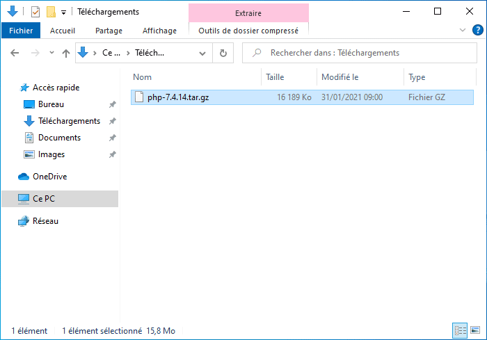

# hash

Windows command-line utility to calculate the checksum of a file.

```
Usage : hash.exe -a <algorithm> -f <filename> [-c] [-m]

-a <algorithm>, --algorithm=<algorithm> : Hash algorithm (adler32, crc32, gost, md2, md4, md5, panama, ripemd, ripemd128, ripemd160, ripemd256, ripemd320, sha0, sha1, sha224, sha256, sha384, sha512, sha512/224, sha512/256, sha3/224, sha3/256, sha3/384, sha3/512, tiger, tiger2, whirlpool)
-c, --clipboard : Copy the hash result to the clipboard
-f <filename>, --file=<filename> : Filename to generate the hash
-m, --message : Display the hash result in a dialog box
-h, --help : Print this help screen
-v, --version : Print the version of the program and exit
```

This program have been created by Yoann LAMY under the terms of the [GNU General Public License v3](http://www.gnu.org/licenses/gpl.html).


Add to the shell context menu (optional) :



CREDITS :
This program use the [HashLib4Pascal library](https://github.com/Xor-el/HashLib4Pascal).
